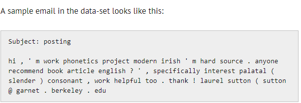

# Spam-Ham classificaiton
This repository contains the code to classify whether a mail is a spam mail or a ham mail using machine learning algorithms. Spam mails are basically junk mails and contains unsolicited messages , while on other hand ham mails are usefull or necessary mails which contains important information . So its really important for softwares to distinguish between them automatically . It can achieved by analyzing the text in the mails.
# Prerequisites 
-  Basic understanding of pyhton and Machine learning concepts .
### Software requirements : 
* Pyhton 3.
* jupyter notebook.
* Anaconda python.
# Dataset
* There are 922 e-mails divided equally between spam and non-spam(ham).The first line of every email contains the subject and the third line contains the body as shown:

### Agorithms used :
* Binary BOW
* BOW
* TFIDF

One can use several other advance algorithms but these basic algorithms produces optimal solution too . You can further deploy this code to create a basic software . 

# HAPPY CODING ;)
